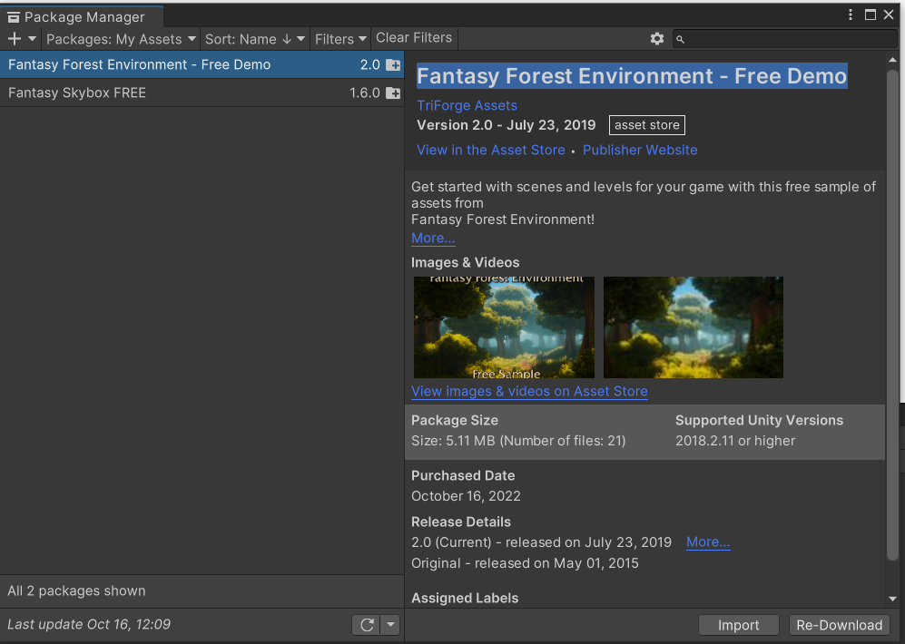
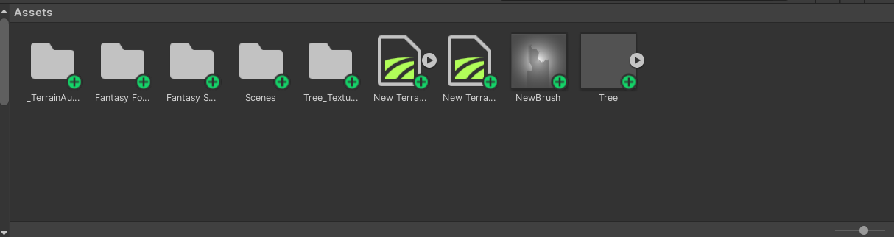
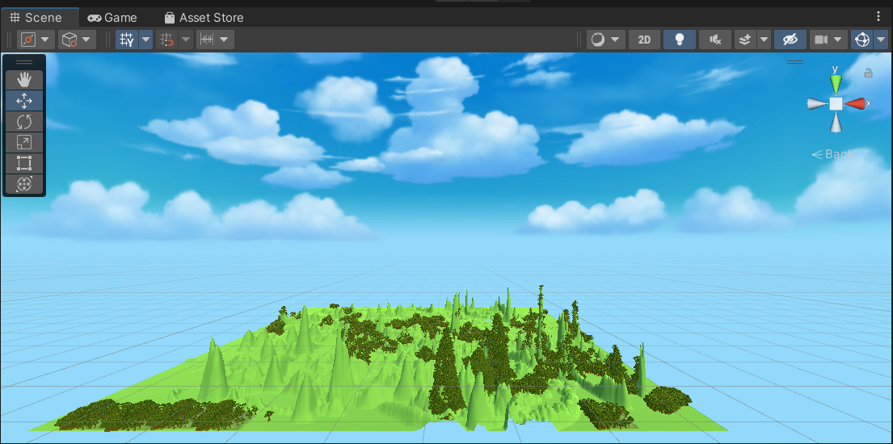
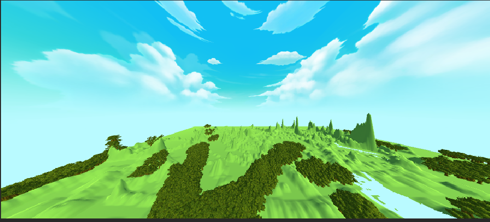

### unity3d专选作业4-fantasy box

使用fantasy box来构建游戏场景

#### 资源下载

在asset store中订阅Fantasy Skybox FREE资源。这里为了后面实验的需要，还额外订阅了Fantasy Forest Environment - Free Demo来绘制树木。下载完成后在package manager中进行import，如下图。

完成import后，asset中就会出现相应的文件夹，如下。

#### 场景构建

fantasy skybox提供了一些背景，这里设置了一个蓝天白云的背景，然后使用一个terrain来构建场景。terrain中可以设置底层，用paint terrain选项来刷出一些地形，然后可以使用Fantasy Forest Environment中提供的tree资源挂载在terrain，就可以刷出一些树木。

构建的场景如下。

